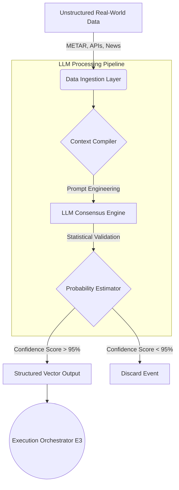

<div align="center">
  <h1>Environmental Consensus Oracle</h1>
  <p><b>LLM-Powered Unstructured Data Ingestion Pipeline</b></p>
  
  [](https://github.com/mahimalam/environmental-consensus-oracle/actions/workflows/ci.yml)
  [](https://python.org)
  [](#)
  [](#)
  [](https://opensource.org/licenses/MIT)

  <p><i>An intelligent data-ingestion framework that transforms chaotic, unstructured environmental data into strict, mathematically actionable consensus vectors.</i></p>
</div>

<br/>

## ⚡ Executive Summary

The **Environmental Consensus Oracle (E4)** solves a critical problem in automated distributed systems: the inability of deterministic algorithms to parse unstructured real-world data. While E1 and E3 excel at executing mathematical graphs, they cannot read news reports, meteorological data, or socio-political structural announcements.

E4 acts as the "eyes and ears" of the ecosystem. It ingests massive amounts of unstructured data (via APIs, WebSockets, and RSS feeds), runs it through advanced Large Language Model (LLM) classification pipelines, and outputs strict, deterministic probabilities that the execution engines can trust.

---

## 🏗️ System Architecture

The architecture utilizes a multi-stage NLP classification pipeline designed for high reliability and zero hallucination.



---

## 🧩 Core Modules

### 1. The Ingestion Layer (`/ingestion`)
A suite of high-availability clients designed to pull physical environmental data.
- **`metar_client.py` & `open_meteo_client.py`**: Ingests raw, specialized meteorological data formats directly from global sensory networks. 
- **`ensemble_client.py`**: Cross-references data against historical run ensembles to establish baseline validity before passing data to the LLMs.
- **`station_registry.py`**: A local cache mapping physical geospatial coordinates to data node identifiers.

### 2. The Logic & Classification Layer (`/core_logic`)
This is the core LLM processing engine.
- **`consensus_builder.py`**: Handles the orchestration of calls to the underlying LLM APIs (e.g., Gemini, Claude). It strictly formats prompts to force the LLM to return data in a parseable JSON schema rather than conversational text.
- **`flash_scorer.py`**: A specialized, low-latency script that uses NLP heuristics to score the immediate impact of an unstructured text string before the heavy LLM call completes.
- **`probability_estimator.py`**: Takes the categorical output from the LLMs and converts it into a continuous float vector (0.0 to 1.0) representing the mathematical confidence of the event.

### 3. The Analytics Engine (`/analytics`)
- **`accuracy_tracker.py` & `pro_calibrator.py`**: Continuously monitors the success rate of the LLM classifications against historical baseline states, automatically calibrating the required confidence thresholds.

---

## ⚙️ Technical Specifications

- **Language:** Python 3.10+
- **LLM Integration:** Built to interface with enterprise-grade endpoints (e.g., Google Vertex AI, Anthropic API) with strict fallback and retry mechanisms for rate-limit handling.
- **Data Validation:** Implements strict Pydantic schemas to ensure that LLM hallucinations cannot structurally corrupt downstream systems. If the LLM output violates the schema, the event is immediately discarded.

---

## 🚀 Deployment Requirements

The Oracle operates as an independent microservice, generating structured data that can be consumed by other network nodes via REST or message queues.

```bash
# Clone the repository
git clone https://github.com/mahimalam/environmental-consensus-oracle.git

# Install dependencies
pip install -r requirements.txt

# Start the LLM pipeline
python main.py --daemon --strict-validation
```

